# WAD - Web Application Document
## The Board - Gerenciador de Tarefas

---

### 1. Visão Geral da Aplicação

O **The Board** é um sistema web completo de gerenciamento de tarefas desenvolvido especificamente para jovens estudantes e profissionais que buscam mais produtividade e clareza em suas rotinas. A aplicação permite organizar tarefas por categorias e origens, acompanhar o progresso com indicadores visuais, gerenciar agendamentos e personalizar o sistema conforme as necessidades individuais.

**Objetivo Principal:** Centralizar o gerenciamento de tarefas pessoais e profissionais, oferecendo controle sobre status, prioridades, prazos e organização por contexto, facilitando a gestão de tempo para estudantes universitários com rotina intensa e múltiplos compromissos.

### 2. Funcionalidades Principais

#### 2.1 Gerenciamento de Usuários
- Sistema de cadastro e controle de usuários
- Autenticação baseada em sessões
- CRUD completo de usuários
- Validação de dados com Joi

#### 2.2 Gerenciamento de Tarefas
- Criação, visualização, edição e exclusão de tarefas
- Controle de status (pendente, em progresso, concluído)
- Sistema de prioridades e importância
- Definição de prazos (data desejada e data limite)
- Controle de progresso percentual
- Associação com usuários, categorias e origens

#### 2.3 Sistema de Categorias
- Criação e gerenciamento de categorias personalizadas
- Sistema de prioridades para categorias
- Organização visual das tarefas por tipo
- CRUD completo de categorias

#### 2.4 Sistema de Origens
- Definição de contextos/origens das tarefas
- Sistema de relevância para priorização
- Separação entre tarefas pessoais, acadêmicas e profissionais
- CRUD completo de origens

#### 2.5 Sistema de Agenda
- Agendamento de blocos de tempo para tarefas
- Controle de horários de início e fim
- Sistema de anotações para cada agendamento
- Visualização cronológica das atividades

#### 2.6 Dashboard Inteligente
- Visão consolidada de todas as funcionalidades
- Gráficos e indicadores de produtividade
- Diário para reflexões e anotações
- Atalhos para ações rápidas

### 3. Interface da Aplicação

#### 3.1 Tela de Login
*Tela de autenticação com campos para email e senha, garantindo acesso seguro e individualizado*

#### 3.2 Dashboard Principal
*Painel central com visão geral das tarefas, gráficos de produtividade e acesso rápido às funcionalidades*

#### 3.3 Tela de Tarefas
*Interface para listagem, criação e edição de tarefas com filtros por categoria e origem*

#### 3.4 Tela de Agenda
*Visualização cronológica das tarefas agendadas com controle de horários*

#### 3.5 Tela de Gráficos
*Indicadores visuais de desempenho e análise de produtividade*

### 4. Arquitetura Técnica

#### 4.1 Padrão MVC
A aplicação segue rigorosamente o padrão Model-View-Controller:
- **Models:** Representam a estrutura de dados e queries SQL
- **Views:** Templates EJS para renderização das páginas
- **Controllers:** Processam requisições e coordenam Model e View

#### 4.2 Diagrama Arquitetural MVC

```mermaid
graph TB
    %% Camada de Apresentação (View)
    subgraph "VIEW LAYER"
        V1["`**Landing Page**
        index.ejs`"]
        V2["`**Dashboard**
        home.ejs`"]
        V3["`**Tasks Management**
        tasks.ejs
        task-form.ejs`"]
        V4["`**Categories**
        categories.ejs`"]
        V5["`**Origins**
        origins.ejs`"]
        V6["`**Agenda**
        agenda.ejs`"]
        V7["`**Users**
        users.ejs`"]
    end

    %% Camada de Controle (Controller)
    subgraph "CONTROLLER LAYER"
        C1["`**userController**
        - getAllUsers()
        - getUserById()
        - createUser()
        - updateUser()
        - deleteUser()`"]
        C2["`**TarefaController**
        - criarTarefa()
        - listarTarefas()
        - obterTarefa()
        - editarTarefa()
        - excluirTarefa()`"]
        C3["`**CategoriaController**
        - criarCategoria()
        - listarCategorias()
        - editarCategoria()
        - excluirCategoria()`"]
        C4["`**OrigemController**
        - criarOrigem()
        - listarOrigens()
        - editarOrigem()
        - excluirOrigem()`"]
        C5["`**AgendaController**
        - criarAgenda()
        - listarAgendas()
        - editarAgenda()
        - excluirAgenda()`"]
    end

    %% Camada de Serviço (Business Logic)
    subgraph "SERVICE LAYER"
        S1["`**userService**
        - createUser()
        - validateUser()
        - hashPassword()`"]
        S2["`**taskService**
        - calculateProgress()
        - validateDeadlines()
        - priorityLogic()`"]
        S3["`**categoryService**
        - organizePriorities()
        - validateCategory()`"]
        S4["`**originService**
        - calculateRelevance()
        - contextValidation()`"]
        S5["`**agendaService**
        - scheduleValidation()
        - timeConflicts()`"]
    end

    %% Camada de Modelo (Model/Repository)
    subgraph "MODEL LAYER"
        M1["`**userModel**
        - getAllUsers()
        - getUserById()
        - createUser()
        - updateUser()
        - deleteUser()`"]
        M2["`**tarefaModel**
        - criarTarefa()
        - listarTarefas()
        - obterTarefa()
        - editarTarefa()
        - excluirTarefa()`"]
        M3["`**categoriaModel**
        - criarCategoria()
        - listarCategorias()
        - editarCategoria()
        - excluirCategoria()`"]
        M4["`**origemModel**
        - criarOrigem()
        - listarOrigens()
        - editarOrigem()
        - excluirOrigem()`"]
        M5["`**agendaModel**
        - criarAgenda()
        - listarAgendas()
        - editarAgenda()
        - excluirAgenda()`"]
    end

    %% Banco de Dados
    subgraph "DATABASE LAYER"
        DB["`**PostgreSQL**
        📊 usuario
        📊 tarefa
        📊 categoria
        📊 origem
        📊 agenda`"]
    end

    %% Roteamento
    subgraph "ROUTING LAYER"
        R1["`**userRoutes**
        /api/users/*`"]
        R2["`**tarefaRoutes**
        /api/tarefas/*`"]
        R3["`**categoriaRoutes**
        /api/categorias/*`"]
        R4["`**origemRoutes**
        /api/origens/*`"]
        R5["`**agendaRoutes**
        /api/agenda/*`"]
        R6["`**frontRoutes**
        /, /tasks, /categories, /origins, /agenda`"]
    end

    %% Middleware
    subgraph "MIDDLEWARE"
        MW["`**Validation Middleware**
        - validate()
        - Joi schemas
        - Error handling`"]
    end

    %% Conexões principais do MVC
    V1 --> C1
    V2 --> C1
    V3 --> C2
    V4 --> C3
    V5 --> C4
    V6 --> C5
    V7 --> C1

    C1 --> S1
    C2 --> S2
    C3 --> S3
    C4 --> S4
    C5 --> S5

    S1 --> M1
    S2 --> M2
    S3 --> M3
    S4 --> M4
    S5 --> M5

    M1 --> DB
    M2 --> DB
    M3 --> DB
    M4 --> DB
    M5 --> DB

    %% Roteamento para Controllers
    R1 --> C1
    R2 --> C2
    R3 --> C3
    R4 --> C4
    R5 --> C5
    R6 --> C1

    %% Middleware
    MW --> C1
    MW --> C2
    MW --> C3
    MW --> C4
    MW --> C5

    %% Estilos
    classDef viewStyle fill:#e1f5fe,stroke:#01579b,stroke-width:2px,color:#000
    classDef controllerStyle fill:#f3e5f5,stroke:#4a148c,stroke-width:2px,color:#000
    classDef serviceStyle fill:#e8f5e8,stroke:#1b5e20,stroke-width:2px,color:#000
    classDef modelStyle fill:#fff3e0,stroke:#e65100,stroke-width:2px,color:#000
    classDef dbStyle fill:#ffebee,stroke:#c62828,stroke-width:3px,color:#000
    classDef routeStyle fill:#f1f8e9,stroke:#33691e,stroke-width:2px,color:#000
    classDef middlewareStyle fill:#fce4ec,stroke:#880e4f,stroke-width:2px,color:#000

    class V1,V2,V3,V4,V5,V6,V7 viewStyle
    class C1,C2,C3,C4,C5 controllerStyle
    class S1,S2,S3,S4,S5 serviceStyle
    class M1,M2,M3,M4,M5 modelStyle
    class DB dbStyle
    class R1,R2,R3,R4,R5,R6 routeStyle
    class MW middlewareStyle
```



#### 4.3 Estrutura de Camadas
- **View Layer:** Templates EJS para renderização das interfaces
- **Controller Layer:** Processamento de requisições e coordenação
- **Service Layer:** Implementação das regras de negócio
- **Model Layer:** Queries SQL e manipulação de dados
- **Database Layer:** PostgreSQL com estrutura relacional
- **Routing Layer:** Definição e organização das rotas API e frontend
- **Middleware:** Validação de dados e tratamento de erros

#### 4.4 Stack Tecnológica
- **Backend:** Node.js + Express.js
- **Banco de Dados:** PostgreSQL
- **Template Engine:** EJS
- **Validação:** Joi
- **Outros:** dotenv, pg, nodemon

### 5. Modelo de Dados

#### 5.1 Diagrama Entidade-Relacionamento
*Estrutura do banco de dados com relacionamentos entre usuários, tarefas, categorias, origens e agenda*

#### 5.2 Entidades Principais

##### 5.2.1 Tabela: usuario
**Descrição:** Armazena os dados de cada usuário do sistema.

**Campos:**
- **id (PK):** Identificador único do usuário (inteiro autogerado)
- **nome (varchar):** Nome completo
- **email (varchar):** Email único para identificação
- **senha (varchar):** Senha criptografada

**Relacionamentos:**
- **1:N com tarefa** → Um usuário pode ter várias tarefas

##### 5.2.2 Tabela: tarefa
**Descrição:** Registra todas as tarefas criadas pelos usuários.

**Campos:**
- **id (PK):** Identificador da tarefa
- **titulo (varchar):** Título resumido
- **descricao (text):** Descrição detalhada
- **status (varchar):** Situação atual
- **data_desejada (date):** Data ideal de conclusão
- **data_limite (date):** Data máxima de entrega
- **importancia (int):** Grau de importância (1 a 5)
- **progresso (int):** Percentual concluído
- **usuario_id (FK):** Referência ao usuário
- **categoria_id (FK):** Referência à categoria
- **origem_id (FK):** Referência à origem

**Relacionamentos:**
- **N:1 com usuario, categoria e origem**
- **1:N com agenda**

##### 5.2.3 Tabela: categoria
**Descrição:** Classifica as tarefas por tipo.

**Campos:**
- **id (PK):** Identificador da categoria
- **nome (varchar):** Nome da categoria
- **prioridade (int):** Grau de prioridade

**Relacionamentos:**
- **1:N com tarefa**

##### 5.2.4 Tabela: origem
**Descrição:** Define o contexto/origem das tarefas.

**Campos:**
- **id (PK):** Identificador
- **nome (varchar):** Nome da origem
- **relevancia (int):** Peso na priorização

**Relacionamentos:**
- **1:N com tarefa**

##### 5.2.5 Tabela: agenda
**Descrição:** Permite agendar blocos de tempo para tarefas.

**Campos:**
- **id (PK):** Identificador
- **tarefa_id (FK):** Referência à tarefa
- **data_inicio (timestamp):** Início do bloco
- **data_fim (timestamp):** Término do bloco
- **anotacoes (text):** Notas adicionais

**Relacionamentos:**
- **N:1 com tarefa**

### 6. API e Rotas

#### 6.1 Endpoints de Usuários
- `GET /api/users` - Listar todos os usuários
- `GET /api/users/:id` - Obter usuário por ID
- `POST /api/users` - Criar novo usuário
- `PUT /api/users/:id` - Atualizar usuário
- `DELETE /api/users/:id` - Excluir usuário

#### 6.2 Endpoints de Tarefas
- `GET /api/tarefas` - Listar todas as tarefas
- `GET /api/tarefas/:id` - Obter tarefa por ID
- `POST /api/tarefas` - Criar nova tarefa
- `PUT /api/tarefas/:id` - Atualizar tarefa
- `DELETE /api/tarefas/:id` - Excluir tarefa

#### 6.3 Endpoints de Categorias
- `GET /api/categorias` - Listar categorias
- `POST /api/categorias` - Criar categoria
- `PUT /api/categorias/:id` - Atualizar categoria
- `DELETE /api/categorias/:id` - Excluir categoria

#### 6.4 Endpoints de Origens
- `GET /api/origens` - Listar origens
- `POST /api/origens` - Criar origem
- `PUT /api/origens/:id` - Atualizar origem
- `DELETE /api/origens/:id` - Excluir origem

#### 6.5 Endpoints de Agenda
- `GET /api/agenda` - Listar agendamentos
- `POST /api/agenda` - Criar agendamento
- `PUT /api/agenda/:id` - Atualizar agendamento
- `DELETE /api/agenda/:id` - Excluir agendamento

#### 6.6 Rotas Frontend
- `GET /` - Página inicial (usuários)
- `GET /tasks` - Página de tarefas
- `GET /categories` - Página de categorias
- `GET /origins` - Página de origens
- `GET /agenda` - Página de agenda

### 7. Segurança e Validação

#### 7.1 Medidas de Segurança
- Validação de dados com Joi em todas as rotas
- Sanitização de entradas do usuário
- Middleware de validação personalizado
- Tratamento adequado de erros

#### 7.2 Schemas de Validação
- **createUserSchema:** Validação para criação de usuários
- **updateUserSchema:** Validação para atualização de usuários
- **createTarefaSchema:** Validação para criação de tarefas
- **updateTarefaSchema:** Validação para atualização de tarefas
- **createCategoriaSchema:** Validação para categorias
- **createOrigemSchema:** Validação para origens
- **createAgendaSchema:** Validação para agendamentos

### 8. Instalação e Execução

#### 8.1 Pré-requisitos
- Node.js (versão 14+)
- PostgreSQL
- npm

#### 8.2 Configuração Rápida
```bash
# 1. Clonar repositório
git clone <repositório>
cd the-board

# 2. Instalar dependências
npm install

# 3. Configurar variáveis de ambiente
cp .env.example .env

# 4. Configurar banco de dados
createdb the_board
npm run init-db

# 5. Executar aplicação
npm start

# 6. Executar em modo desenvolvimento
npm run dev
```

#### 8.3 Scripts Disponíveis
- `npm start` - Executa a aplicação em produção
- `npm run dev` - Executa com nodemon para desenvolvimento
- `npm test` - Executa os testes
- `npm run test:coverage` - Executa testes com cobertura
- `npm run init-db` - Inicializa o banco de dados

### 9. Estrutura do Projeto

```
the-board/
├── controllers/          # Controllers MVC
│   ├── userController.js
│   ├── TarefaController.js
│   ├── CategoriaController.js
│   ├── OrigemController.js
│   └── AgendaController.js
├── models/              # Models para acesso ao banco
├── routes/              # Definição das rotas
│   ├── userRoutes.js
│   ├── tarefaRoutes.js
│   ├── categoriaRoutes.js
│   ├── origemRoutes.js
│   ├── agendaRoutes.js
│   └── frontRoutes.js
├── views/               # Templates EJS
├── middlewares/         # Middlewares customizados
├── validators/          # Schemas de validação Joi
├── config/              # Configurações do banco
├── scripts/             # Scripts de inicialização
└── server.js           # Arquivo principal
```

### 10. Testes e Qualidade

#### 10.1 Framework de Testes
- **Jest:** Framework principal para testes unitários
- **Supertest:** Para testes de integração HTTP
- Cobertura de código implementada

#### 10.2 Tipos de Testes
- Testes unitários dos controllers
- Testes de integração das rotas
- Validação dos schemas Joi
- Testes de conexão com banco de dados

### 11. Conclusão

O **The Board** representa uma solução completa e moderna para gerenciamento de tarefas, especificamente projetada para atender às necessidades de estudantes e jovens profissionais. A arquitetura MVC bem estruturada, combinada com um sistema robusto de validação e um banco de dados relacional organizado, oferece uma base sólida para futuras expansões.

A aplicação demonstra competência técnica em desenvolvimento full-stack moderno, implementando as melhores práticas de desenvolvimento web com Node.js, desde a modelagem de dados até a criação de APIs RESTful, passando por aspectos cruciais como validação de dados e arquitetura de software.

O sistema de categorias e origens permite uma organização inteligente das tarefas, enquanto o sistema de agenda oferece controle temporal preciso, tornando o The Board uma ferramenta verdadeiramente útil para gestão de produtividade pessoal.

---

**Projeto Acadêmico** | **Autor:** Eduardo Khaled Chmouri Guardiano  
**Instituição:** Inteli - Instituto de Tecnologia e Liderança  
**Tecnologias:** Node.js, Express, PostgreSQL, EJS, Joi  
**Padrão Arquitetural:** MVC